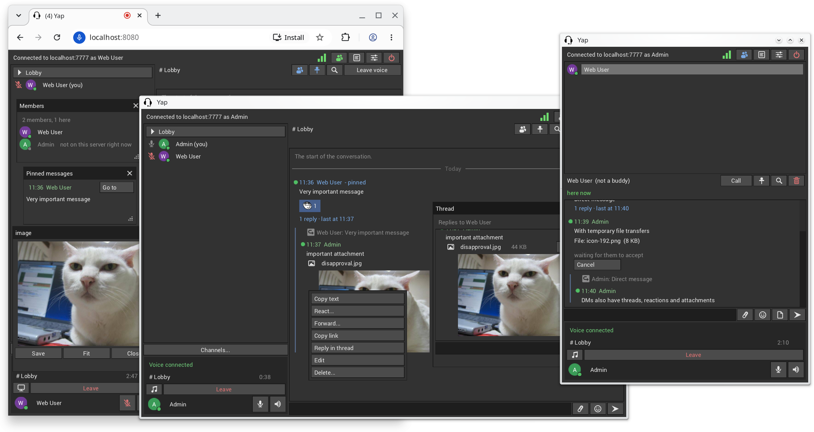

A sloppy, minimal and limited VOIP application.

- Single binary client and server (client about 4 MiB, server about 2.2)
- Runs on Linux, Windows, macOS (and optionally in a browser)
- Uses only UDP (WebSocket for web client)
- Minimal runtime dependencies (Mostly only Glfw)
- Uses [noise protocol](https://noiseprotocol.org) for encryption between client and server\*
- Uses [RNN](https://github.com/xiph/rnnoise) and Opus (with three options 24kbit/s, 64kbit/s and 192kbit/s stereo)
- Channels to subscribe to, each with a chat and a voice room: looking at a
  channel and talking in it are separate, and nobody is in voice until they
  join
- Chat in every channel, kept on the server for good and read back a page at
  a time; messages arrive for all your channels, not only the one on screen
- Paste images from clipboard into chat (stored once, however often posted)
- Per user volumes, muting and poking
- Accounts, made by an admin; a device logs in once and is known by its key after
- Optional server password; the client remembers the last 10 servers
- No permission system
- Per user direct chats with file transfers
- Screen sharing (low frame rate) between web clients (not for native clients)
- Global hotkeys (requires `input` group on wayland)
- Option to share audio of a specific application (native clients only)

## Running a server

```sh
yap-server               # or: yap-server path/to/config.json
```

The first run writes `config.json` (see `config.example.json`): the port,
the server's private key, an optional password, logging, the web relay
and the channels to start with (the first is the home channel everyone is
in; after the first start the channels live in the database, and the
owner makes more from the client's Channels window). Next to it, or in the config's `data_dir`, the
server keeps its database (`yap.db`) and a `blobs` folder.

People need an account to get in, and accounts are made by an admin. A
server that has none makes one called `admin` when it starts and writes its
password to the log, once; log in with that, choose a password of your
own, and make the others from the client's settings. The same can be done
without a client:

```sh
yap-server account list
yap-server account add <username>      # prints a first password
yap-server account passwd <username>   # a new one, if it was forgotten
```

A device logs in once; after that the server knows it by its key.

Messages and pictures are kept for good unless `retention` in the config
says otherwise (`message_days`, `image_days`, `blob_megabytes`; 0 keeps
everything); the server applies it at startup and every hour. Whoever has
the Purge permission can also purge from the client's settings, and with
the server stopped:

```sh
yap-server purge all 90d               # messages older than 90 days
yap-server purge Lobby 2026-01-01 pictures   # only the pictures, before a day
```

Pinned messages are kept. Purged content is gone from the database and
the `blobs` folder, but not from backups taken before.

\*I have no idea how encryption works
